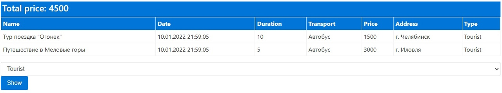
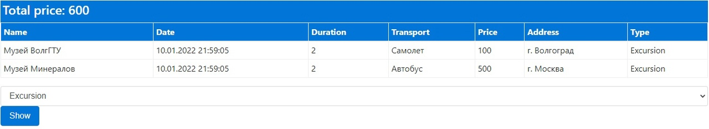

# TP_Kurs_Sulitskiy
Курсовой проект выполнен на тему "Туристические поездки". Проект представляет собой Веб-приложение, предоставляющее просмотр различных тур поездок с информацией о них. Имеется возможность просмотра по типа тура.

# 1. Пример работы 
Далее представлены примеры работы веб-приложения, фильтрация по типа поездок

Туристические поездки

Экскурсии

Круизы

# 2. Хранение информации
Хранение информации представлено в двух вариантах. База данных и чтение из листа. Для чтение из базы данных был создан класс forDB, в нем осущетсвляется привязка(создание БД) по именованию полей модели для дальнейшей работы с ней. (вставить картинку кода)

Пример полей Бд в MSSQL

Чтобы осуществить чтение из листа, требуется заполнить следующие строки в файле MemoryRepository (вставить картинку кода)

# 3. Средства для реализации Веб-приложения
 (вставить картинку нугета)
 
# 4. MVC

